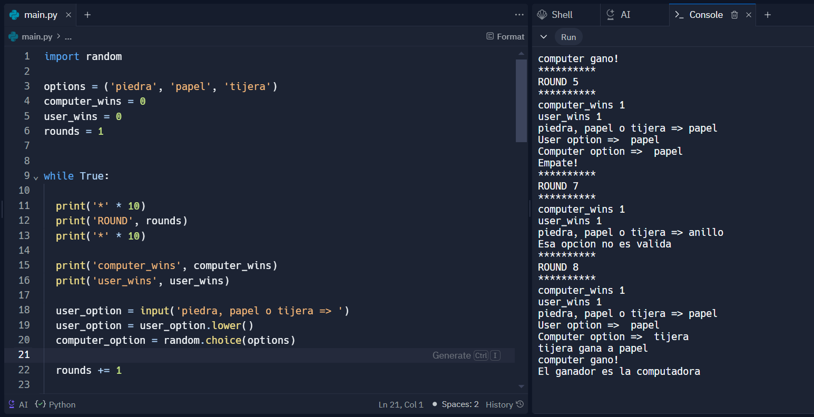

# Rock, Paper, Scissors Game in Python

This project is a simple implementation of the Rock, Paper, Scissors game in Python. The game is played against the computer. The computer's choice is randomly generated, while the user inputs their choice via standard input.

## How to Play

The game is played in rounds, and the first player (either the user or the computer) to win two rounds wins the game. After each round, the current state of the game is displayed, including each player's choice and the number of rounds won by each player.

The game follows the standard rules of Rock, Paper, Scissors:

- Rock beats Scissors
- Scissors beats Paper
- Paper beats Rock

If both the user and the computer choose the same option, the round is a draw.

The game continues until one of the players wins two rounds. At that point, the winner is declared and the game ends.

## Requirements

- Python 3.x

## How to Run

1. Clone this repository.
2. Run `python main.py` in your terminal.

## Screenshot

